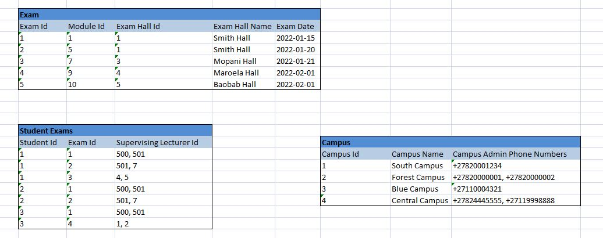

## SECTION 1 

Lorem Ipsum University needs some help designing a basic database to keep track of courses offered, enrolled students, exam schedules and employed lecturers.
Please help them build a Microsoft SQL database with the following specifications:

a) A reference table to keep track of type of student (pre-grad, post-grad, modular).  The lookup table must allow for student types to be uniquely identified & also 
have a short description of each type.  Pre-grad are students who haven't completed all their courses and modules yet, post-grad have completed all courses or modules required for a degree,
and modular are students who enroll with the objective of only doing a random assortment of modules (not working towards a degree).
b) A table to keep track of all student information.  The university is expecting vast amounts of students to enroll in the course of time so the primary key needs to cater for very 
large numbers.  They need to know the name, surname and date of birth of each student, as well as the age of each student (which must be calculated automatically based on the date of birth).
Please note that the student id will be printed on access cards and to avoid confusion the university needs ids to start at 1000000, with a gap of 1000 between student ids 
(ie the first student's id will be 1000000, the next will be 1001000, then 1002000 etc)
c) A list of courses offered by the university.  Each course needs an identifier + name, as well as an indicator of whether the course is currently offered.  The default value for this must be true,
showing that a course is offered unless otherwise specified.
d) A list of modules, each with identifier & name and an optional description.
e) Each student has one exact type.
f) Each student can enroll for many courses, and each course can be taken by any number of students.
g) Each course can have many modules, but each module can only belong to 1 course.
h) They also need a list of lecturers with an id, name + surname, and a list of which courses they teach.  Lecturers often cross-specialise and can therefore teach any number of courses, sometimes
taking turns or swopping courses with lecturers who may be focusing on other fields of interest or who are on leave.

Please design + create a database schema that covers the above specifications and show the resulting database diagram displaying all entities & relationships.  
Also please send the script that will create this database with all tables, constraints, keys, default values, identity specifications, column data types etc.

## SECTION 2
Based on the above, Lorem Ipsum University realised that they also need a data structure to keep track of scheduled exams.  Exams are taken in person and there is one exam for each module (per semester)
- An exam is written in a specific lecture hall, and lecture halls are scattered across the university's different campuses.
- Exams are written at different times during any given day.
- Each semester the university admin department generates an exam time table per student to make sure they know when and where each of their own exams will take place.
- The university admin department also generates a list that shows each exam with the list of students that are supposed to write it to give to the 2 supervising lecturers in order to take roll call.

Somebody in the admin department started designing a rough database / entity structure as per the included diagram, but then realised their database isn't fully normalised and is missing some information.
Please fix it for them.

## SECTION 3
After fixing the structure and integrating it with section 1, please write 2 simple optimised queries that will generate the exam time table per student, as well as a list of all students that should be 
attending any given exam.

